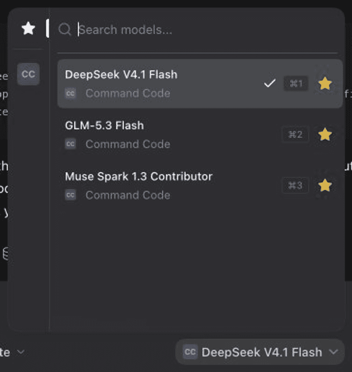
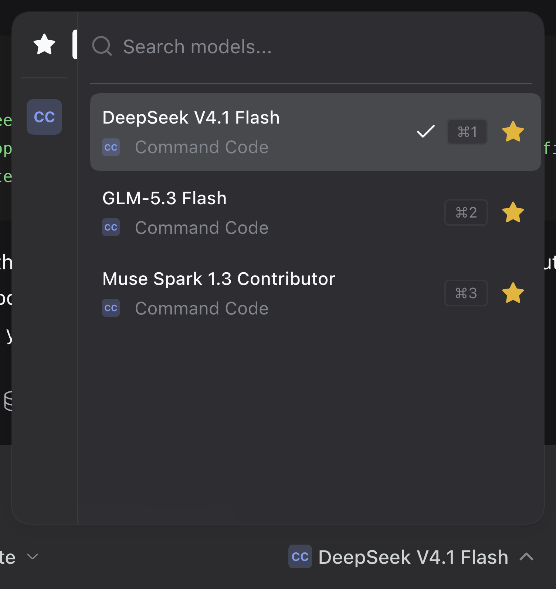
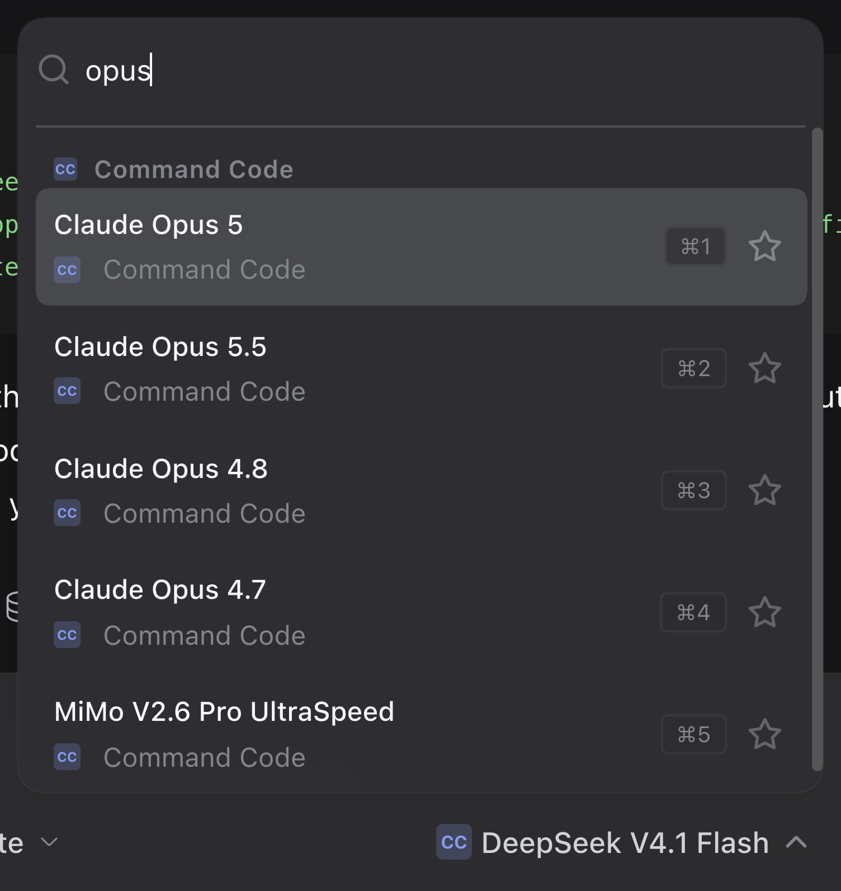
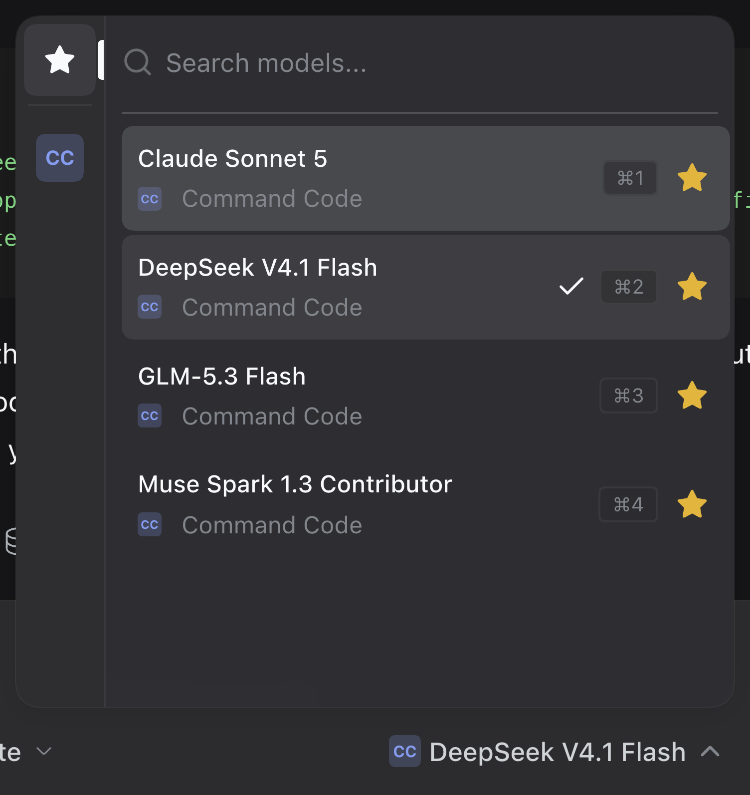

# dsh-t3-model-picker

A model picker for the [DeepSeek Harness](https://github.com/deepseek-ai/deepseek-harness) composer,
ported from [T3 Code](https://github.com/pingdotgg/t3code)'s model selector.



Open the picker, search across every provider, star what you use, and reach the
first nine rows with `Cmd`/`Ctrl`+`1`…`9`.

## Credit

The selector this plugin implements is T3 Code's `ProviderModelPicker`. The
provider rail, the borderless search field, the row layout with a provider
footer, the favorites model, the tiered search ranking, and the `Cmd`+`1`…`9`
jump chords are all theirs. T3 Code is
[open source under MIT](https://github.com/pingdotgg/t3code/blob/main/LICENSE);
this port keeps the same behaviour and swaps the data underneath for DeepSeek
Harness's model directory. Please support the original project.

## Features

- **Provider rail.** A 44px column with `Favorites` first and one tile per
  advertised provider. The active entry carries a primary-colored indicator.
- **Search.** The field takes focus when the picker opens. Matching uses tiered
  scoring over the model name, its description, the provider id and the
  provider name, including subsequence matching for queries of three characters
  or more, with a small boost for favorites. Results are grouped under provider
  headings.
- **Favorites.** A star on every row, stored in the browser under
  `dsh.t3-model-picker.favorites.v1` as `[{ provider, model }]`. The Favorites
  rail entry lists them grouped by provider.
- **Jump shortcuts.** `Cmd`+`1`…`9` on macOS, `Ctrl`+`1`…`9` elsewhere, select
  the first nine rows of the visible list; each of those rows shows its chord in
  a `kbd` chip. The listener is live only while the card is open.
- **Unavailable models.** Providers the host does not report as routable are
  marked on their rows, on the rail tile's tooltip, and on the trigger.
- **Reasoning effort.** A footer row opens the effort levels the current model
  advertises. It is hidden when the model exposes none.

## Install

Through the plugin registry:

```sh
dsh plugin --profile web add dsh-t3-model-picker
```

From this repository:

```sh
dsh plugin --profile web add github:yusufameri/dsh-t3-model-picker
```

Both reconcile the profile's bundle list, so the next boot merges the plugin's
patch and loads its client half. Removing the bundle restores the shipped model
selector with no residue.

## Screenshots

| Picker open on Favorites | Grouped search results | Favorites after starring |
|---|---|---|
|  |  |  |

## How it works

The composer's `conversation.input.model` seat is a `single` slot. Two
occupants can coexist there at different priorities, and the lowest live
priority renders, so this plugin registers at `-1` and the shipped
`ModelSelect` at its default `0` stops rendering.

Both read the *same* per-session model directory (`ctx.modelDirectories`), which
is also what the `/model` command popup uses. A model chosen here is what those
surfaces show next, and a selection made there is what this picker highlights.

| File | Role |
|---|---|
| `package.json` | Bundle manifest: `dsh.bundle.patch` plus the `dsh.client` web half |
| `cordis.patch.yml` | One `insert` row mounting the bundle |
| `index.js` | Host half — empty; the feature is entirely browser-side |
| `client.js` | Client half: the picker, its styles, favorites and shortcuts |

## Differences from T3 Code

Three deliberate departures, all recorded in `client.js`:

- Search results are grouped under provider headings. T3 renders one flat
  ranked list with the provider named on each row.
- A footer row keeps the reasoning-effort selector reachable. T3 keeps effort
  in a sibling control, while in DeepSeek Harness this seat is the composer's
  only effort control.
- The row of the model in use carries a check mark. This seat is single-select
  and the trigger is not always in view.

## Known limits

- The picker needs a session-scoped model directory. Addressed subagent
  sessions expose none, so the seat stays absent there.
- Jump chords are open-only, as in T3. There is no closed-picker shortcut.
- The effort footer only ever shows models whose provider advertises reasoning
  metadata.

## Development

No build step: `client.js` is plain JavaScript in the format the client module
loader takes. Edit it and reload the page.

`scripts/` holds the recording tooling used for the assets above. It drives the
running DeepSeek Harness page over the Chrome DevTools Protocol, so no browser
download is needed:

```sh
node scripts/record.mjs <run-dir>                       # frames + stills + timeline
node scripts/encode-gif.mjs <run-dir> <out.gif> --fps 12 --speed 1.8 --start 1.14
```

`record.mjs` expects the page to show a session whose composer carries the
picker, and it restores the browser's favorites when it finishes. The encoder
crops, resizes, and assembles the GIF with `sharp`; it needs no `ffmpeg`.

## License

[MIT](LICENSE). The interface this plugin reproduces comes from
[T3 Code](https://github.com/pingdotgg/t3code), MIT licensed, by its authors.
